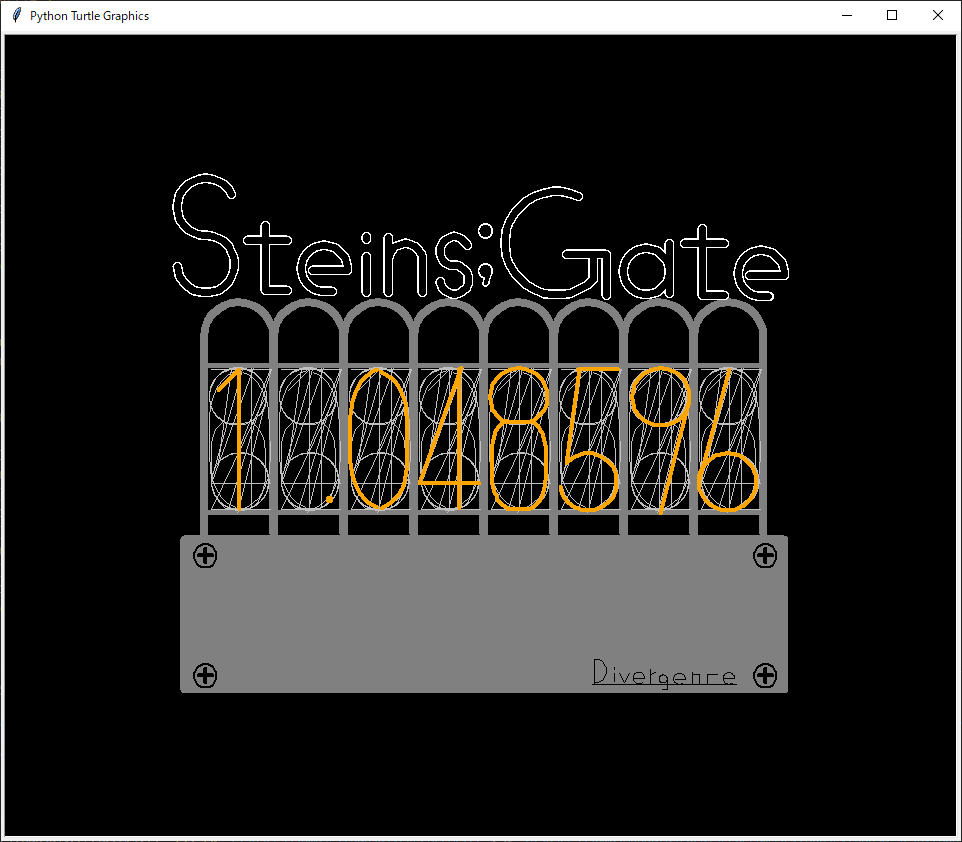

# Divergence Meter
大学一年生のころ、課題で作った初めてのプログラムです。  
STEINS;GATEというゲームに登場するダイバージェンスメーターを作画しています。  
初めてのコーディングということもあり極めて読みづらいプログラムではありますが、あえてそのままにしておきます。  

- 作画の様子(動画は4倍速です)  
[YouTube](https://youtu.be/aDbkuz3VbD0)

- 完成図  
